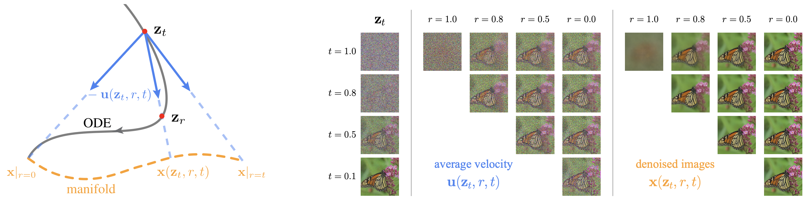

# Pixel Mean Flows

[](https://arxiv.org/abs/2601.22158)&nbsp;
[](https://opensource.org/licenses/MIT)&nbsp;
[](https://huggingface.co/Lyy0725/pMF)&nbsp;


<p align="center">
  
</p>

This is the official JAX implementation for the paper [One-step Latent-free Image Generation with Pixel Mean Flows](https://arxiv.org/abs/2601.22158). This code is written and tested on TPUs. 

For HSDP implementation, please refer to [this branch](https://github.com/Lyy-iiis/pMF/tree/hsdp), where we provide HSDP training and inference code for pMF-H models.
For PyTorch implementation, please refer to [this branch](https://github.com/Lyy-iiis/pMF/tree/torch).

## Initialization

Run `install.sh` to install the dependencies (JAX+TPUs). Log in to WandB to track your experiments if needed.

```bash
bash scripts/install.sh
wandb login YOUR_WANDB_API_KEY
```

## Inference

You can quickly verify your setup with our provided checkpoint.
<table><tbody>
<td valign="bottom">ImageNet 256x256</td>
<td valign="bottom" align="center">pMF-B/16</td>
<td valign="bottom" align="center">pMF-L/16</td>
<td valign="bottom" align="center">pMF-H/16</td>
<tr><td align="left">pre-trained checkpoint (inference) </td>
<td align="center"><a href="https://huggingface.co/Lyy0725/pMF/blob/main/pMF-B-16.zip">download</td>
<td align="center"><a href="https://huggingface.co/Lyy0725/pMF/blob/main/pMF-L-16.zip">download</td>
<td align="center"><a href="https://huggingface.co/Lyy0725/pMF/blob/main/pMF-H-16.zip">download</td>
</tr>
<tr><td align="left">pre-trained checkpoint (full) </td>
<td align="center"><a href="https://huggingface.co/Lyy0725/pMF/blob/main/pMF-B-16-full.zip">download</td>
<td align="center"><a href="https://huggingface.co/Lyy0725/pMF/blob/main/pMF-L-16-full.zip">download</td>
<td align="center"><a href="https://huggingface.co/Lyy0725/pMF/blob/main/pMF-H-16-full.zip">download</td>
</tr>
<tr><td align="left">FID (this repo / original paper)</td>
<td align="center">3.11/3.12</td>
<td align="center">2.50/2.52</td>
<td align="center">2.11/2.22</td>
</tr>
<tr><td align="left">IS (this repo / original paper)</td>
<td align="center">256.4/254.6</td>
<td align="center">266.0/262.6</td>
<td align="center">270.5/268.8</td>
</tr>
</tbody></table>

<table><tbody>
<td valign="bottom">ImageNet 512x512</td>
<td valign="bottom" align="center">pMF-B/32</td>
<td valign="bottom" align="center">pMF-L/32</td>
<td valign="bottom" align="center">pMF-H/32</td>
<tr><td align="left">pre-trained checkpoint (inference) </td>
<td align="center"><a href="https://huggingface.co/Lyy0725/pMF/blob/main/pMF-B-32.zip">download</td>
<td align="center"><a href="https://huggingface.co/Lyy0725/pMF/blob/main/pMF-L-32.zip">download</td>
<td align="center"><a href="https://huggingface.co/Lyy0725/pMF/blob/main/pMF-H-32.zip">download</td>
</tr>
<tr><td align="left">pre-trained checkpoint (full) </td>
<td align="center"><a href="https://huggingface.co/Lyy0725/pMF/blob/main/pMF-B-32-full.zip">download</td>
<td align="center"><a href="https://huggingface.co/Lyy0725/pMF/blob/main/pMF-L-32-full.zip">download</td>
<td align="center"><a href="https://huggingface.co/Lyy0725/pMF/blob/main/pMF-H-32-full.zip">download</td>
</tr>
<tr><td align="left">FID (this repo / original paper)</td>
<td align="center">3.64/3.70</td>
<td align="center">2.73/2.75</td>
<td align="center">2.37/2.48</td>
</tr>
<tr><td align="left">IS (this repo / original paper)</td>
<td align="center">274.4/271.9</td>
<td align="center">276.6/276.8</td>
<td align="center">285.3/284.9</td>
</tr>
</tbody></table>

Note that slight differences in FID/IS may arise due to different computation setups. Our results are computed from TPU v5p-64.


#### Sanity Check

1. **Download the checkpoint and FID stats:** 
    - Download the pre-trained checkpoint from the table above.
    - Download the FID stats file from [here](https://huggingface.co/Lyy0725/pMF/blob/main/imagenet_256_fid_stats.npz) and [here](https://huggingface.co/Lyy0725/pMF/blob/main/imagenet_512_fid_stats.npz). Our FID stats is computed on TPU and JAX, which may slightly differ from those computed on GPU and PyTorch. You can also compute FID stats using `prepare_ref.py` if needed.

2. **Unzip the checkpoint:**
    ```bash
    unzip <downloaded_checkpoint.zip> -d <your_ckpt_dir>
    ```
    Replace `<downloaded_checkpoint.zip>` and `<your_ckpt_dir>` with your actual paths.

3. **Set up the config:**
    - Set `load_from` in `configs/eval_config.yml` to the path of `<your_ckpt_dir>`.
    - Set `fid.cache_ref` to the path of the downloaded FID stats file.
    - Set parameters for corresponding model, e.g., `model.model_str` and `sampling`.

4. **Launch evaluation:**
    ```bash
    bash scripts/eval.sh JOB_NAME
    ```
    Our default evaluation script generates 50,000 samples using pre-trained pMF-B/16 for FID and IS evaluation. The expected FID and IS is 3.11 and 256.4 for this checkpoint. (compared to 3.12 and 254.6 reported in the original paper)

## Setup

### Data Preparation

Before training, you need to download the [ImageNet](http://image-net.org/download) dataset and extract it to your desired location. The dataset should have the following structure:
```
imagenet/
├── train/
│   ├── n01440764/
│   ├── n01443537/
│   └── ...
└── val/
    ├── n01440764/
    ├── n01443537/
    └── ...
```

### Configuration Setup

After data preparation, you need to configure your FID cache reference in the config files:

#### 1. Update Config Files

Edit your config file (e.g., `configs/pMF_B_16_config.yml`) and replace the placeholder values:

```yaml
dataset:
    root: YOUR_DATA_ROOT  # Path to your dataset, only for training config

fid:
    cache_ref: YOUR_FID_CACHE_REF  # Path to your FID statistics file

logging:
    wandb_project: 'YOUR PROJECT'  # Your WandB project name
```

#### 2. Available Config Files

- `configs/pMF_B_16_config.yml` - Configuration for pMF-B/16 model training (recommended)
- `configs/pMF_B_32_config.yml` - Configuration for pMF-B/32 model training
- `configs/pMF_L_16_config.yml` - Configuration for pMF-L/16 model training
- `configs/pMF_L_32_config.yml` - Configuration for pMF-L/32 model training
- `configs/default.py` - Default configuration (Python format, used as base)

**Configuration Hierarchy:**
The system uses a hierarchical approach where `pMF_B_16_config.yml` and `eval_config.yml` override specific parameters from `default.py`. This allows you to customize only the parameters you need while keeping sensible defaults.
Make sure to update both the dataset root path and the FID cache reference path according to your data preparation output.

## Training

Run the following commands to launch training:
```bash
bash scripts/launch.sh JOB_NAME
```

**Note:** Update the environment variables in `scripts/train.sh` before running:
- `DATA_ROOT`: Path to your prepared data directory
- `LOG_DIR`: Path where to save training logs

#### Config System

The training system uses two config files:

- **`configs/default.py`** - Base configuration with all default hyperparameters
- **`configs/pMF_B_16_config.yml`** - Model-specific overrides for pMF-B/16 training

The system merges these files, allowing you to customize only the parameters you need.

#### Customizing Training

To create a custom experiment:

1. **Create a new config file** (e.g., `configs/my_exp_config.yml`)
2. **Update the launch script** to use your config:
   ```bash
   # In launch.sh, change the config line to:
   --config=configs/load_config.py:my_exp
   ```

**Example custom config:**
```yaml
training:
    num_epochs: 80                  # Train for fewer epochs

model:
    model_str: pmfDiT_B_16               # Use pMF-B/16 model
    noise_scale: 1.0                 # Set noise scale
```

for more details on configuration options, refer to `configs/default.py` and `configs/pMF_B_16_config.yml`.

## License

This repo is under the MIT license. See [LICENSE](./LICENSE) for details.

## Citation

If you find this work useful in your research, please consider citing our paper :)

```bib
@article{pixelmeanflows,
  title={One-step Latent-free Image Generation with Pixel Mean Flows},
  author={Lu, Yiyang and Lu, Susie and Sun, Qiao and Zhao, Hanhong and Jiang, Zhicheng and Wang, Xianbang and Li, Tianhong and Geng, Zhengyang and He, Kaiming},
  journal={arXiv preprint arXiv:2601.22158},
  year={2026}
}
```

## Contributors

This repository is a collaborative effort by Kaiming He, Hanhong Zhao, Qiao Sun and Yiyang Lu, developed in support of several research projects, including [MeanFlow](https://arxiv.org/abs/2505.13447), [improved MeanFlow](https://arxiv.org/abs/2512.02012), and [BiFlow](https://arxiv.org/abs/2512.10953).

## Acknowledgement

We gratefully acknowledge the Google TPU Research Cloud (TRC) for granting TPU access.
We hope this work will serve as a useful resource for the open-source community.